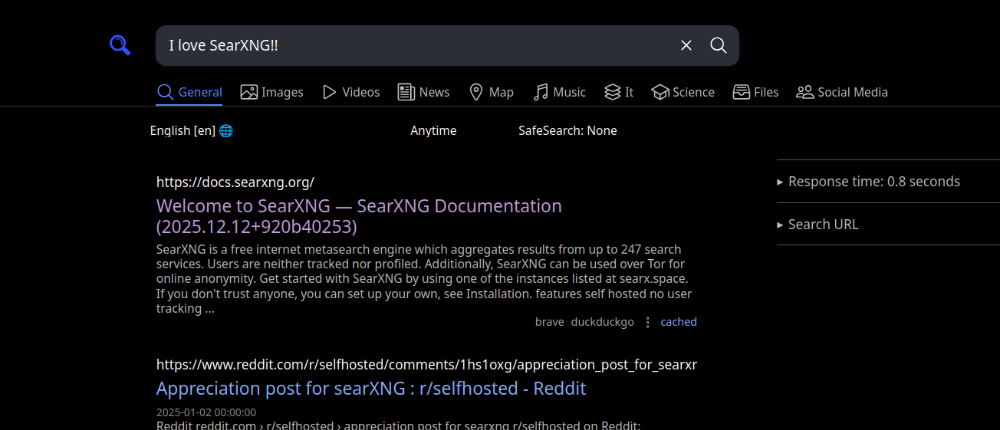
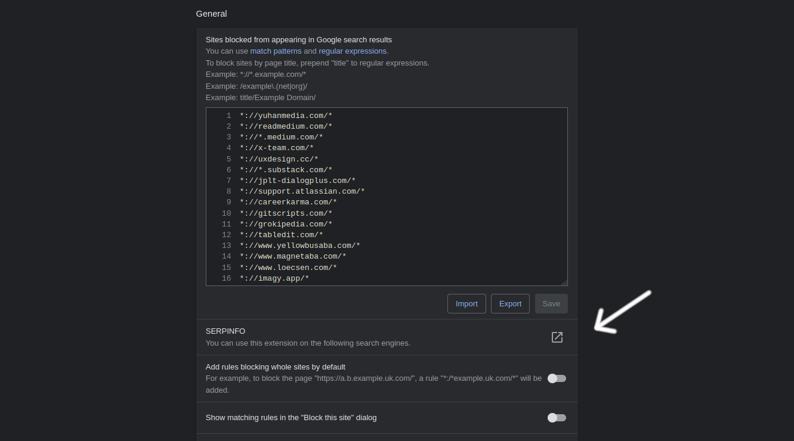

A few months ago, I set up my own local SearXNG docker image and it's honestly been one of the best decisions I've ever made for my machine. It's a way to add a layer of privacy between you and all of the search engines you use. Not only can you avoid having a profile of you get built by companies who sell your data, but I find SearXNG also gives you a better user experience because it aggregates results from many different engines at once. It's so much easier to find what you're actually looking for when you use SearXNG.



# Installing Docker

To get this to work, you must have docker installed. If you don't, take care of that first before you complete any of the next steps.

On Arch Linux, it is as simple as running `sudo pacman -Syu docker`.

# Installing SearXNG-Docker

All of these next steps are also available on the readme at [searxng-docker's github repo.](https://github.com/searxng/searxng-docker)

To get searxng-docker on our machine, clone the git repo to `/usr/local` and navigate there.

```
cd /usr/local
git clone https://github.com/searxng/searxng-docker.git
cd searxng-docker
```

Generate the secret key with the following command, so you have a secret key in your `settings.yml`. You just have to run it, no need to edit the actual `settings.yml` file.

```
sed -i "s|ultrasecretkey|$(openssl rand -hex 32)|g" searxng/settings.yml
```

Now just run `docker compose up -d` and you should be able to see your SearXNG instance at `http://localhost:8080`.

# Configuring the SearXNG Instance For Use With HTTPS

Setting `http://localhost:8080` to be the default search engine in Firefox doesn't work. Firefox seems to correctly identify SearXNG's OpenSearch plugin, but searches cannot be completed with the address bar or through other interfaces except directly through the search bar while you are already on the page `http://localhost:8080`. It seems that Firefox doesn't allow such pages to be implemented as a search engine. To fix this, we must serve SearXNG over HTTPS.

## Install and Setting Up mkcert

mkcert is a tool for making locally-trusted development certificates. I can install it via pacman with `sudo pacman -Syu mkcert`.

For install instructions on other platforms, you should see the readme at [mkcert's github repo.](https://github.com/FiloSottile/mkcert)

Then run `mkcert -install` to set up a local certificate authority.

## Generating Certs to Use with SearXNG

If you aren't already in `/usr/local/searxng-docker`, cd there and then run

```
mkcert localhost
```

mkcert should then give you two files called `localhost.pem` and `localhost-key.pem`. Put these two files in `/usr/local/searxng-docker/certs` (you will have to create this directory). **DO NOT share these keys. Keep them private.**

You do not actually have to name the certificate "localhost." If you want to use a fake domain name like "mysearch.test" you can do this by editing `/etc/hosts` and adding the line

```
127.0.0.1 mysearch.test
```

## Configuring Caddyfile

Now open your Caddyfile. Add these four lines of code below the first block:

```
https://localhost {
	tls /certs/localhost.pem /certs/localhost-key.pem
	reverse_proxy searxng:8080
}
```

Make sure the `tls` line points to the location of the `.pem` files you just generated.

Then replace 

```
# SearXNG
reverse_proxy localhost:8080
```

with

```
# SearXNG
reverse_proxy searxng:8080
```

## Configuring docker-compose.yaml

Now open your `docker-compose.yaml`. Replace the entire `caddy:` block with this 

```
  caddy:
    container_name: caddy
    image: docker.io/library/caddy:2-alpine
    depends_on:
      - searxng
    restart: unless-stopped
    networks:
      - searxng # <-- Attach to searxng
    ports:
      - "127.0.0.1:443:443" # <-- Map localhost port 443 to container port 443
    volumes:
      - ./Caddyfile:/etc/caddy/Caddyfile:ro
      - ./certs:/certs:ro  # <-- Your mkcert certs go here
      - caddy-data:/data:rw
      - caddy-config:/config:rw
    environment:
      - SEARXNG_HOSTNAME=${SEARXNG_HOSTNAME:-localhost}
      - SEARXNG_TLS=${LETSENCRYPT_EMAIL:-internal}
    logging:
      driver: "json-file"
      options:
        max-size: "1m"
        max-file: "1"
```

Effectively, we are mapping the localhost port 443 to the container port 443. You can change the host port (e.g., "8443:443") to avoid conflicts. We also add a line to volumes so that caddy can see the certs we generated with mkcerts. 

Now navigate down to the `searxng:` block. Replace the entire thing with this:

```
  searxng:
    container_name: searxng
    image: docker.io/searxng/searxng:latest
    restart: unless-stopped
    networks:
      - searxng
    expose:
      - "8080"  # <-- Internal only
    volumes:
      - ./searxng:/etc/searxng:rw
      - searxng-data:/var/cache/searxng:rw
    environment:
      - SEARXNG_BASE_URL=https://${SEARXNG_HOSTNAME:-localhost}/ # <-- The base URL is modified
    logging:
      driver: "json-file"
      options:
        max-size: "1m"
        max-file: "1"
```

This makes port 8080 available only to other containers on the Docker network and not the host. No one else on the network has access to SearXNG. 

Now run:
```
docker compose restart caddy
docker compose restart searxng
```

We can now access SearXNG via Caddy at `https://localhost` and use this local instance as our search engine in Firefox!

# EXTRA: Making This Work With uBlacklist

uBlacklist is a Firefox addon that lets you add "blacklists," or lists of sites that you don't want showing up in your search results. It's also available for Chrome, but using Chrome defeats the purpose of configuring SearXNG in the first place. Don't use Chrome with this.

The default implementation of uBlacklist supports SearXNG, but only through a list of publically available instances in its SERPINFO list. That means uBlacklist cannot see your private instance of SearXNG.

To fix this, go to the extension's Options page. Under "General", click "SERPINFO".



Then under "My SERPINFO", add the following code:

```
name: SearXNG
homepage: https://github.com/ublacklist/builtin#readme

pages:
  - name: All
    includeRegex: "/search(\\?|$)"
    results:
      - root: .category-general
        url: a
        props:
          title: h3
          $category: [const, "web"]
      - root: .category-images
        url: .result-url > a
        props:
          title: .title
          $category: [const, "images"]
      - root: .category-videos
        url: a
        props:
          title: h3
          $category: [const, "videos"]
      - root: .category-news
        url: a
        props:
          title: h3
          $category: [const, "news"]
    commonProps:
      $site: searx # backwards compatibility
    matches:
     - https://localhost/*
```

You should be able to use SearXNG with uBlacklist now. If you're not using "localhost" as your domain name, you need to change the last line to match it.
